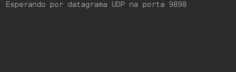
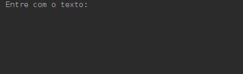
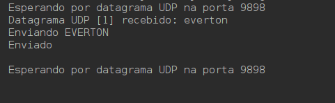
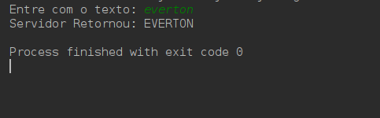

# UDPCapitalize

Trabalho da disciplina de Sistemas Distribuídos [UFT] para aprender sobre conexões UDP.

O trabalho foi desenvolvido em Java e inclui uma classe para o servidor e uma classe para o cliente. A classe servidor fica aguardando conexões do cliente, para receber uma string, converter em letras maiúsculas e retornar para o cliente.

## Imagens da Aplicação

*Server 1*

*Client 1*

*Server 2*

*Client 2*

## Autores

* **Everton Barbosa Jr** - Aluno - [ejkun](https://github.com/ejkun)
* **Thiago Magalhães** - Professor Orientador